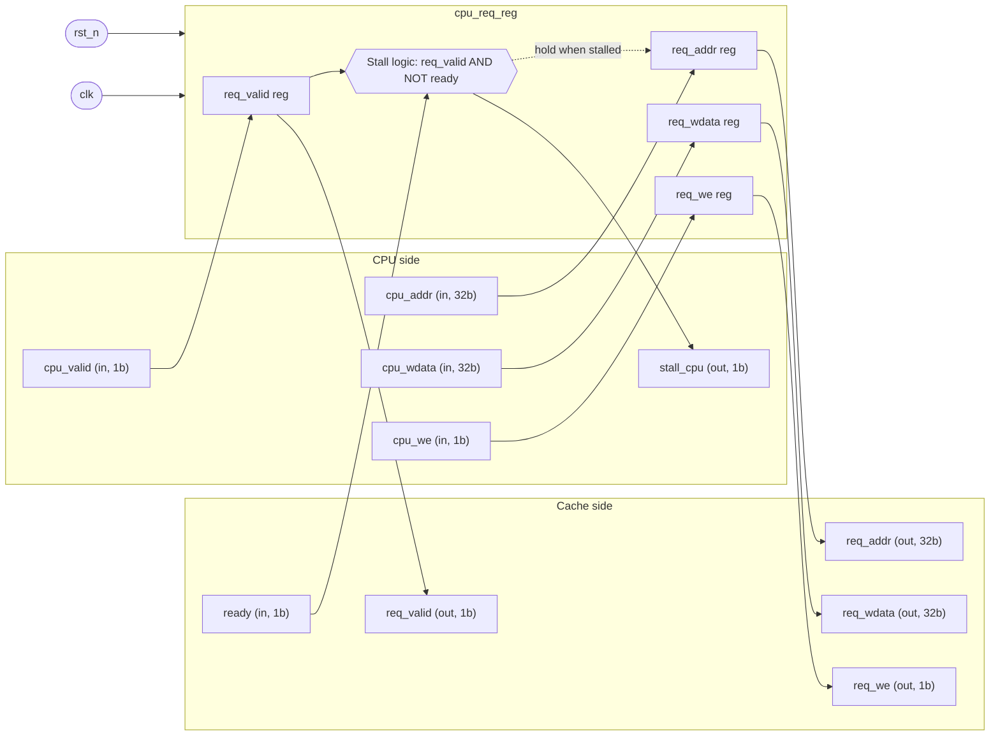

```mermaid
flowchart LR
    clk([clk]) --> REG
    rst([rst_n]) --> REG

    subgraph CPU["CPU side"]
        cv["cpu_valid (in, 1b)"]
        ca["cpu_addr (in, 32b)"]
        cd["cpu_wdata (in, 32b)"]
        cw["cpu_we (in, 1b)"]
        sc["stall_cpu (out, 1b)"]
    end

    subgraph REG["cpu_req_reg"]
        rv["req_valid reg"]
        ra["req_addr reg"]
        rd["req_wdata reg"]
        rw["req_we reg"]
        st{{"Stall logic: req_valid AND NOT ready"}}
    end

    subgraph CACHE["Cache side"]
        ov["req_valid (out, 1b)"]
        oa["req_addr (out, 32b)"]
        od["req_wdata (out, 32b)"]
        ow["req_we (out, 1b)"]
        rdy["ready (in, 1b)"]
    end

    cv --> rv
    ca --> ra
    cd --> rd
    cw --> rw

    rv --> ov
    ra --> oa
    rd --> od
    rw --> ow

    rdy --> st
    rv --> st
    st --> sc
    st -. "hold when stalled" .-> ra
```
